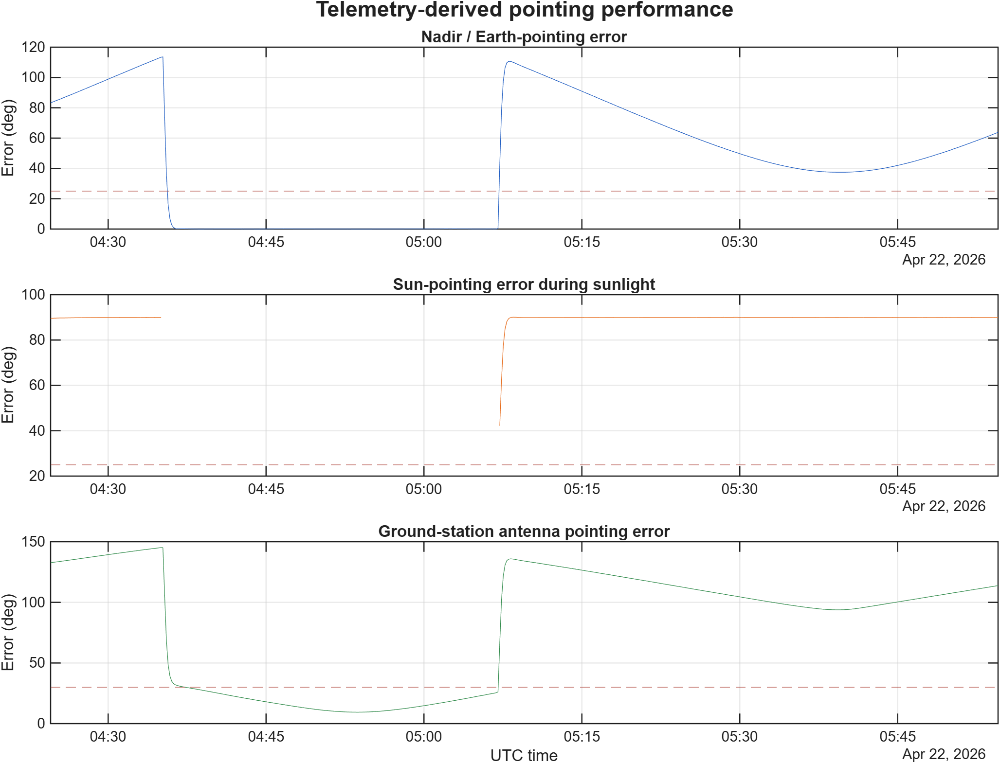
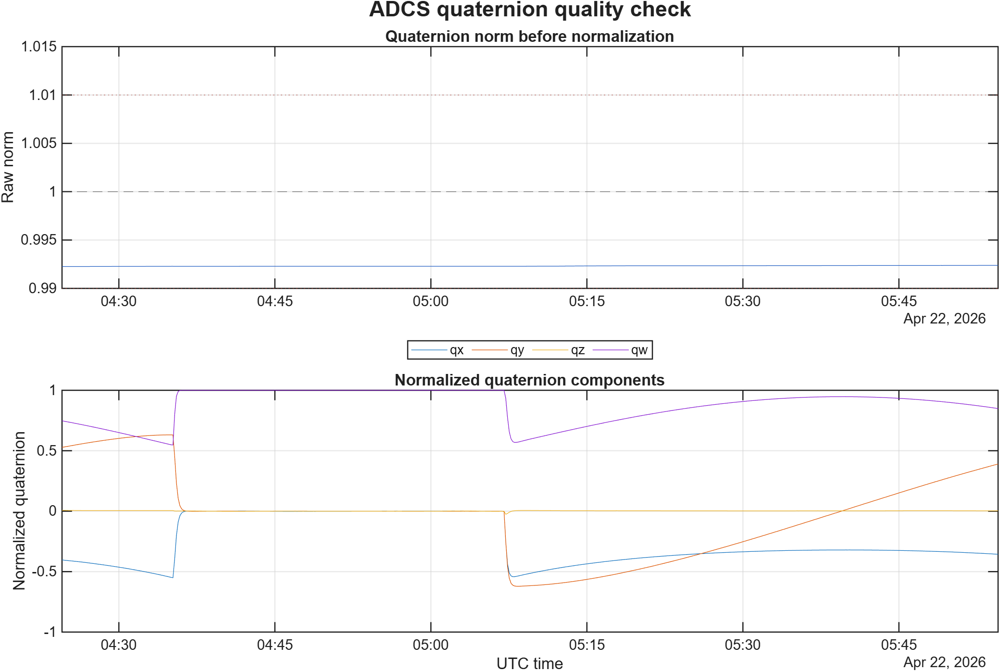
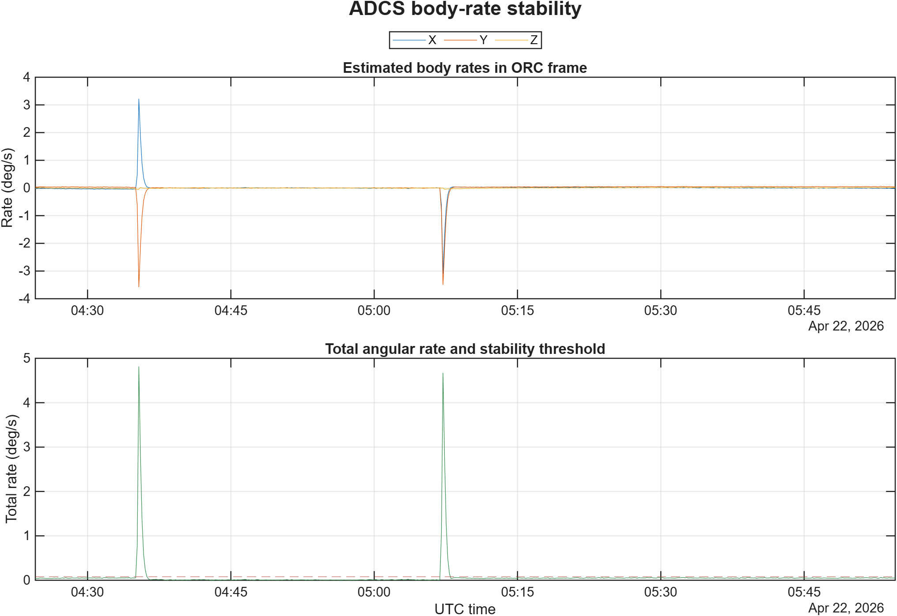
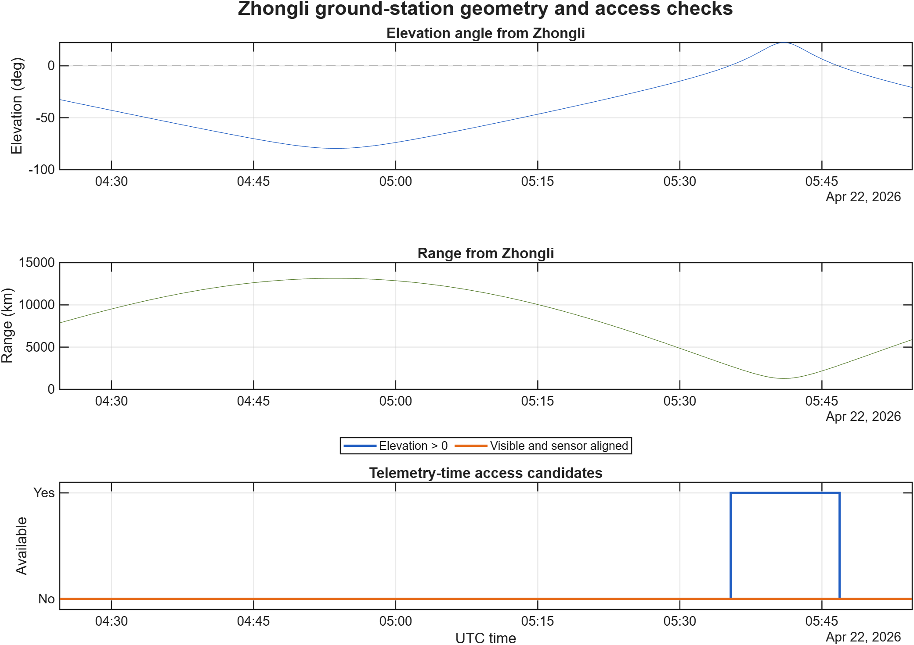

# RIoT-2 ADCS Attitude Reconstruction and Ground-Station Access Analysis

MATLAB-based satellite attitude analysis project using TLE orbit data and ADCS quaternion telemetry to reconstruct RIoT-2 spacecraft motion, animate the 3D orbit scenario, evaluate attitude stability, and analyze Zhongli ground-station access.



## Overview

This project turns raw satellite telemetry into an engineering-level ADCS and mission-availability analysis workflow. It starts from TLE orbit propagation and ADCS quaternion logs, reconstructs spacecraft attitude, checks quaternion quality, evaluates body-rate stability, calculates pointing errors, and compares geometric ground-station visibility with attitude-constrained access.

The original script focused on 3D animation and access calculation. The enhanced version adds quantitative figures, CSV outputs, and a Markdown analysis report suitable for portfolio presentation.

## Key Features

- TLE-based orbit propagation with MATLAB `satelliteScenario`
- ADCS quaternion attitude reconstruction
- 3D satellite scenario animation
- Quaternion norm and component quality check
- Body-rate stability analysis
- Nadir, Sun, and ground-station pointing error calculation
- Zhongli ground-station elevation and range analysis
- Geometric access, sensor-limited access, and link-window comparison
- Automatic figure, CSV, and Markdown report export

## Repository Structure

```text
.
├── all_simulate.m
├── all_simulate_enhanced.m
├── enhanced_figures_explanation.md
├── TLE/
│   ├── tles.txt
│   └── 1776831872 4-30-RIoT-2-log.csv
└── outputs_enhanced/
    ├── summary_metrics.csv
    ├── attitude_access_timeseries.csv
    ├── geometric_access_windows.csv
    ├── sensor_limited_access_windows.csv
    ├── communication_link_windows.csv
    └── figures/
        ├── 01_quaternion_quality.png
        ├── 02_body_rate_stability.png
        ├── 03_pointing_errors.png
        └── 04_access_timeline.png
```

## Results Summary

| Metric | Result |
|---|---:|
| ADCS telemetry rows | 541 |
| Telemetry span | 90 minutes |
| Quaternion coverage | 100.0% |
| Median raw quaternion norm | 0.9923 |
| Body-rate RMS | 0.3524 deg/s |
| Stable-rate fraction | 97.60% |
| Median nadir pointing error | 43.84 deg |
| Median Sun pointing error | 89.97 deg |
| Median ground-station pointing error | 101.11 deg |
| Geometric access windows | 1 |
| Sensor-limited access windows | 0 |
| Link windows | 0 |

## Analysis Figures

### Quaternion Quality



Checks whether the raw quaternion telemetry is close to a valid unit quaternion before normalization. The norm remains stable around `0.992`, indicating that the telemetry is suitable for attitude reconstruction after normalization.

### Body-Rate Stability



Shows the estimated X/Y/Z body rates and total angular rate. Most of the analyzed period is stable, with two short angular-rate spikes that may correspond to attitude-control actions or transient disturbances.

### Pointing Performance


Converts quaternion telemetry into nadir, Sun, and Zhongli ground-station pointing errors. This makes the ADCS behavior easier to interpret than raw quaternion values alone.

### Ground-Station Access



Compares Zhongli ground-station elevation, range, and telemetry-time access candidates. The satellite has one geometric access window, but no sensor-limited or communication link window under the current attitude and view-angle assumptions.

## How to Run

Open MATLAB, set the current folder to this repository, then run:

```matlab
all_simulate_enhanced
```

To enable the 3D satellite animation, change:

```matlab
show3DViewer = false;
```

to:

```matlab
show3DViewer = true;
```

The enhanced script writes results to:

```text
outputs_enhanced/
```

## Engineering Interpretation

The analysis shows that the quaternion telemetry is stable enough for reconstruction and that the satellite is attitude-stable for most of the selected ADCS log. One geometric pass over the Zhongli ground station is detected, but the attitude-constrained sensor and link checks do not produce a valid window.

This highlights a key mission-analysis principle:

> Geometric visibility does not guarantee mission availability.

For an actual mission opportunity, the satellite must be visible from the ground station and correctly oriented so the relevant sensor or antenna is aligned with the target.

## Assumptions and Limitations

- Body-axis definitions are assumed and should be calibrated with spacecraft CAD or ADCS documentation.
- The ground-station direction calculation uses an approximate ECEF-to-ECI conversion.
- Sensor alignment is evaluated using a simplified angular threshold.
- Link availability depends on MATLAB link modeling assumptions and does not yet include a full RF link budget.
- The ADCS mode is inferred from telemetry-derived behavior, not from a commanded mode field.

## Future Improvements

- Calibrate body axes using spacecraft mechanical documentation
- Add commanded ADCS mode comparison
- Add detumbling detection using body-rate thresholds
- Add Doppler shift and full link-budget analysis
- Add batch processing for multiple ADCS logs
- Export a short animation or GIF for GitHub preview
- Build a MATLAB App Designer interface for selecting TLE and ADCS logs

## Portfolio Value

This project demonstrates satellite orbit propagation, quaternion-based attitude reconstruction, ADCS stability analysis, ground-station access evaluation, engineering visualization, and automated report generation. It is suitable for aerospace, control systems, communications, and systems engineering portfolio presentation.

